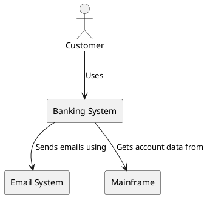
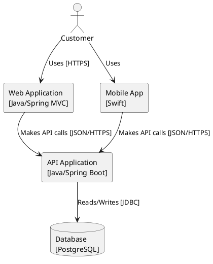
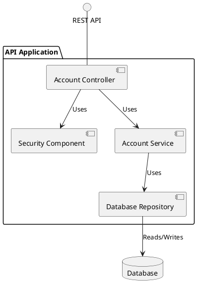
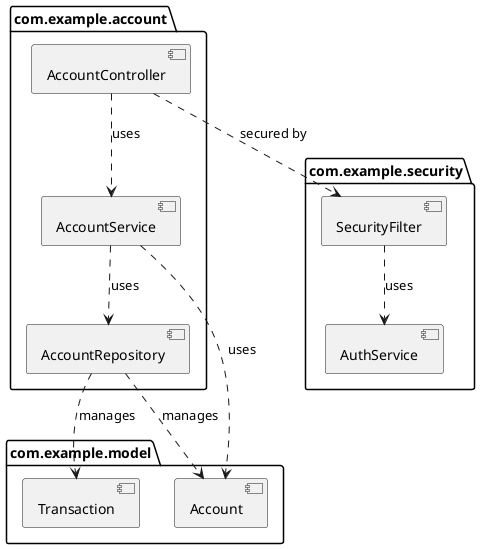
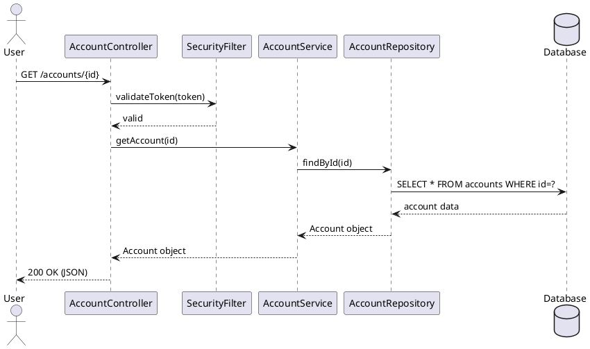

# C4 Model Architecture Reference

## Overview

The C4 model provides a structured way to visualize software architecture at different levels of abstraction. Created by Simon Brown, it consists of hierarchical diagrams: Context, Containers, Components, and Code.

## Core Principles

1. **Abstraction-first**: Different diagrams for different audiences
2. **Hierarchical zoom**: Each level zooms into the previous level
3. **Simple notation**: Easy to learn and understand
4. **Tool-agnostic**: Can be created with any diagramming tool

## The Four Levels

### Level 1: System Context Diagram

**Purpose**: Show the system in context with users and other systems

**Audience**: Everyone (technical and non-technical)

**Elements**:
- **Person**: A user of the system (internal or external)
- **Software System**: The system being described or external systems

**Relationships**:
- Shows how people use systems
- Shows how systems interact with each other

**Key Questions**:
- Who uses the system?
- What other systems does it interact with?
- What is the system's boundary?

**Example Scenario**:
- Online banking system showing customers, bank staff, and integration with email system and mainframe banking system

---

### Level 2: Container Diagram

**Purpose**: Show high-level technology choices and how containers communicate

**Audience**: Technical people (developers, architects, operations)

**Elements**:
- **Container**: An application or data store (NOT Docker containers)
  - Examples: Web application, mobile app, database, file system, microservice

**Relationships**:
- Shows communication between containers
- Includes technology choices and protocols

**Key Questions**:
- What are the major executable/deployable units?
- What technology stack is used for each?
- How do containers communicate (HTTP, gRPC, message queues)?

**Example Scenario**:
- Online banking system decomposed into: Web Application (Java/Spring), Mobile App (Swift), API Application (Java/Spring), Database (PostgreSQL)

---

### Level 3: Component Diagram

**Purpose**: Show major structural building blocks within a container

**Audience**: Software architects and developers

**Elements**:
- **Component**: A grouping of related functionality with well-defined interface
  - Examples: Controllers, services, repositories, business logic modules

**Relationships**:
- Shows dependencies between components
- Shows which components use others

**Key Questions**:
- What are the major logical components?
- What are their responsibilities?
- How do they depend on each other?
- What are the key interfaces?

**Example Scenario**:
- API Application container showing: Security Component, Account Summary Controller, Account Service, Database Repository

---

### Level 4: Code Diagram

**Purpose**: Show how components are implemented at the code level

**Audience**: Software developers

**Elements**:
- **Classes/Interfaces**: Actual code structures
- **Components**: For higher-level code organization

**Diagram Types**:
1. **UML Component Diagrams**: Show static structure, dependencies, provided/required interfaces
2. **UML Sequence Diagrams**: Show dynamic interactions, message flows, lifetimes

**Key Questions**:
- How is the component implemented?
- What are the key classes/interfaces?
- How do objects interact at runtime?
- What is the sequence of operations?

**When to Use Each**:
- **Component Diagrams**: Static architecture, package structure, compile-time dependencies
- **Sequence Diagrams**: Runtime behavior, interaction flows, temporal ordering

**Example Scenarios**:
- Component diagram showing packages and their dependencies
- Sequence diagram showing authentication flow through multiple classes

---

## PlantUML Implementation Guidelines

### General Rules

1. **No Themes or Colors**: Use default black and white for compatibility
2. **Simple Syntax**: Avoid advanced features not supported in older PlantUML versions
3. **Clear Labels**: Every element should have descriptive name
4. **Explicit Relationships**: Use clear relationship syntax with labels

### Context Diagram (Level 1)

### Container Diagram (Level 2)

### Component Diagram (Level 3)

### Code - Component Diagram (Level 4)

### Code - Sequence Diagram (Level 4)

## Best Practices

### 1. Start High, Go Low
Always start with Context diagram, then zoom into specific areas as needed. Don't jump straight to Code level.

### 2. One Diagram Per Concern
Keep diagrams focused on one aspect or area. Better to have multiple simple diagrams than one complex diagram.

### 3. Use Meaningful Names
- "Account Service" not "Service1"
- "PostgreSQL Database" not "DB"
- "Mobile Banking App" not "Mobile"

### 4. Show Technology Choices
At Container and Component levels, include technology in brackets:
- "Web Application [React/TypeScript]"
- "API Gateway [Kong]"
- "Message Queue [RabbitMQ]"

### 5. Label Relationships
Always label arrows with what is being communicated:
- "Makes API calls [JSON/HTTPS]"
- "Sends email notifications"
- "Reads customer data from"

### 6. Prefer Sequence for Dynamic Behavior
When showing how components interact at runtime (Level 4 Code), use sequence diagrams instead of component diagrams to show temporal ordering and message flows.

### 7. Keep It Simple
- Limit to 5-9 elements per diagram (cognitive limit)
- Use consistent notation
- Avoid crossing lines where possible
- Group related elements

## Common Patterns

### Microservices Architecture
- **Context**: Show system and external dependencies
- **Container**: Each microservice as a container, show message buses, API gateways
- **Component**: Zoom into one microservice, show internal components
- **Code**: Show key classes and their interactions within one component

### Layered Architecture
- **Context**: Show system users and external integrations
- **Container**: Show tiers (presentation, application, data)
- **Component**: Show components within one tier (e.g., controllers, services, repositories)
- **Code**: Show classes within one layer, or sequence of calls across layers

### Event-Driven Architecture
- **Context**: Show system and event sources/sinks
- **Container**: Show event bus, publishers, subscribers
- **Component**: Show event handlers, processors within a subscriber
- **Code**: Use sequence diagrams to show event flow through components

## References

- C4 Model Website: https://c4model.com
- PlantUML Documentation: https://plantuml.com
- PlantUML Component Diagrams: https://plantuml.com/component-diagram
- PlantUML Sequence Diagrams: https://plantuml.com/sequence-diagram
